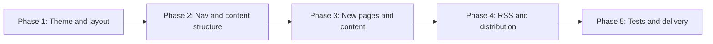

# Planning – Future Improvements

High-level roadmap for UI/UX, content, and technical improvements to the personal homepage.

## Overview

Improvements fall into three areas:

- **UI/UX** – New color palette (light and dark), white/dirty-white background, dark mode, bottom bar with copyright, theme toggle, social links, logotype in circle, menu styling (uppercase), Tags in nav, hamburger on narrow screens, tags below posts and monospace in note/article views, pagination redesign.
- **Content** – About page enhancements (photo, description, tech/specialization, MailerLite, contact), Search page (big input + tags with usage counts), Philosophy subpage, RSS feed, mailing list integration, optional social share, Previous/Next on notes.
- **Technical** – Content status (DRAFT/PUBLISHED, drafts only in dev), unit tests, E2E (Playwright), Google Analytics, SEO improvements list, pipeline (PR checks, Vercel preview + production).

## Phases

Recommended order to avoid rework:

### Phase 1 – Foundation (theme and layout)

- New color palette: light (white/dirty-white background, dark-almost-black text) and dark mode.
- Main active color: dark green.
- Bottom bar: copyright (2007–2026), “Made with love by Szymon Konczal”, theme toggle, social links (LinkedIn, GitHub, X, Instagram).
- Logotype: circle with initials; white on black (light mode), reversed (dark mode).

Enables consistent styling for all later UI work.

### Phase 2 – Navigation and content structure

- Menu: uppercase via CSS only; add Tags link below Articles/Notes; hamburger menu on narrow viewports.
- Default note/article single view: tags below post content; monospace font (e.g. Courier New) for body.
- Redesign pagination component.

### Phase 3 – New pages and content

- Search page: big input at top, list of tags with usage count below.
- Philosophy subpage (route + content).
- About page: photo, description, technology and specialization, MailerLite widget, contact email.

### Phase 4 – Content and distribution

- RSS feed for notes and articles.
- MailerLite mailing list integration (e.g. About page).
- Optional: share posts on social media.
- Previous/Next note links on note single page.

### Phase 5 – Technical quality and delivery

- Content status: DRAFT / PUBLISHED; drafts visible only in dev.
- Unit tests (lib/content, key utilities).
- E2E tests with Playwright (home, note, article, search).
- Google Analytics.
- SEO improvements: document list (meta tags, Open Graph, sitemap, etc.).
- Pipeline: run on PR with all checks; Vercel preview on PR, production on push to `main`.

## Dependencies

- Dark mode and new palette before logotype variants (light vs dark).
- Tag usage counts (lib/content/tags or equivalent) before Search page tag list.
- Content status and filtering before E2E if tests assume only published content in prod.

## Out of scope / TBD

- **Share posts on Social Media** – Optional; scope (which networks, where to place) TBD.
- **SEO** – Deliver a list of improvements (meta, OG, sitemap, etc.); full implementation not part of this roadmap.
